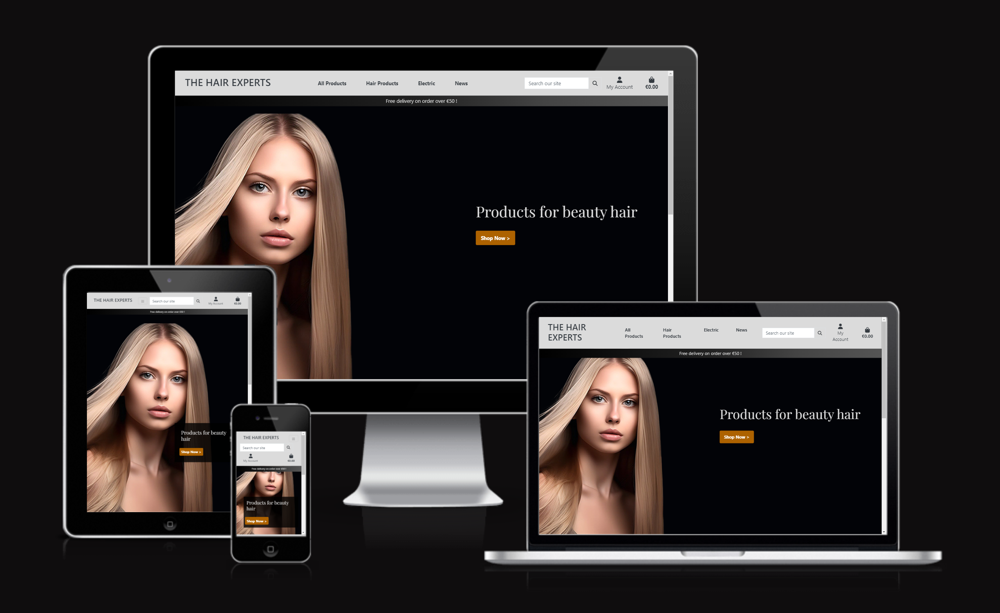
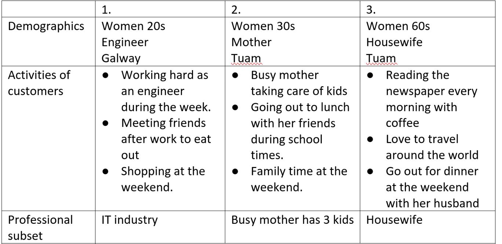
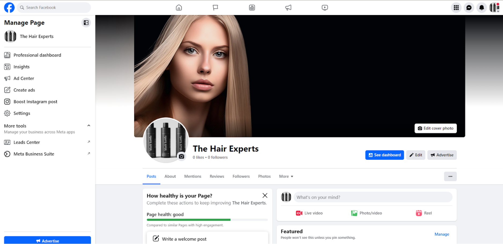
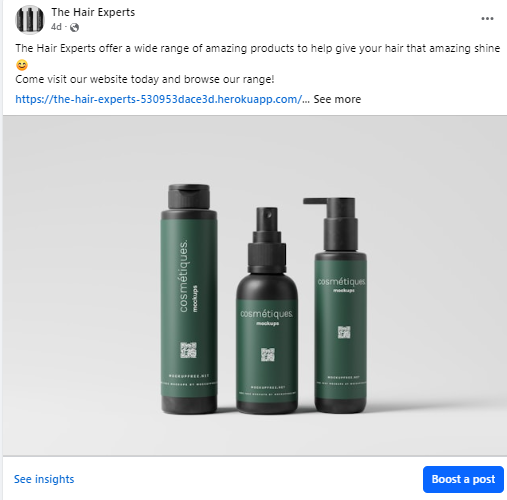

# The Hair Experts

The Hair Experts is the fifth project in the Code Institute Diploma in Full Stack Software Development.
It is a B2C ( Business to Consumer) full stack E-commerce website that offers a range of hair care products and treatments. User’s can create accounts, browse through a selected range of hair care products and items, add them to their basket and purchase them. Users also have the ability to create wishlists and leave comments on products. 

The project was developed using Django, Python, JavaScript, HTML5, CSS and a Postgres relational database to store the site's data. Stripe was used as the payment system

The project was developed using Agile methodologies. This was tracked using Githubs built in boards so I could create Sprints to track the Epics and User Stories.

## Project Goals ##

### Project Goal ###

The goal of the project is to create a full stack website for The Hair Experts built and developed using the Django framework, Bootstrap and CSS. Using Stripe as a payment system and to be deployed on the internet using Heroku and AWS S3 for storing files.

The project was designed to be easy to use and have a simple flow from product searching to product purchasing. 

### User Goals ###

- As a site user I want to shop and browse for hair care products and items.
- As a site user I want to be able to create an account on the website which will track my purchase history and keep track of the wishlist I have created.
- As a site user I want to be able to leave reviews/comments on products I have bought.
- As a site user I want to buy products securely. 

### Site Owner Goals ###

- As a site owner I want to have a platform to sell hair care products to people in Ireland, England and Europe.
- As a site owner I want a site that is known for its reliability.
- As a site owner I want a site that can grow.

## E-Commerce Business Model ##

**Business model: B2C** 

### Target Audience ###

From 20 to 60 year old women who live in Ireland that are also interested in hair products. 

### Vision ###

To provide customers with top-of-the-range hair solutions and the products that help their hair health reach its full potential.

### Objectives ### 

The Main objective is to increase profit streams from the online store and expand the market to other demographics and businesses. 

### Strategy ###

**To achieve this we need to:**

- Increase the website’s SEO
- Increase Facebook followers
- Increase news letter subscribers

### Digital Marketing ### 

#### Facebook ####

The hair experts will mainly use facebook to advertise our business.
This is the best place to focus on because 75.6% of the population in Ireland are using it. We will plan to upload to our Facebook at least twice a day, one for around lunch time and one for before bed time when our target audience who are busy during the day might have a better chance to see our page. We will research facebook insights to monitor clicks and engagement rates to see how effectively our facebook page and posts are working. We will also take advantage of Facebook advertising to reach as many people as possible. This can be run cheaply by setting a target audience for specific people to advertise. As this e-commerce site grows, running YouTube and google ads would be the next step to increase the company’s online presence which will help to increase our profit.

**Facebook Business Page**

**Example post**

#### Increase the Website’s SEO ####

We have a news section that can be updated often. 
We will use keywords that are related to hair products and update on a weekly basis. Topics are something related to hair like how to keep your hair healthy and tips to keep your hair shiny.
This will increase the site’s activity and improve engagement with our customers.

**News Page :**

Upload the contents that are associated mainly with hair and beauty and also sometimes topics that are using current trending keywords to increase the traffic a few times a week. Google Keyword Planner and Google trends are useful tools to find suitable keywords.

### Keyword research ###

Searched keywords with [Wordtracker](https://www.wordtracker.com/search?query=professional%20hair%20products%20for%20women) and [Keyserch](https://www.keysearch.co/)

**Meta tag**

Used long tail keyword

### Email Marketing ### 

Website has a newsletter section where customers can subscribe and get our news and special offers. We use mailchimp to send our campaigns so that we can track 
Open rates, click through rates and bounce rates.
This is good because we can test our emails to see what works or does not work.
Sending email to our customers also increases our website’s traffic and leads to calls to action.
We will use facebook posts to increase subscribers.