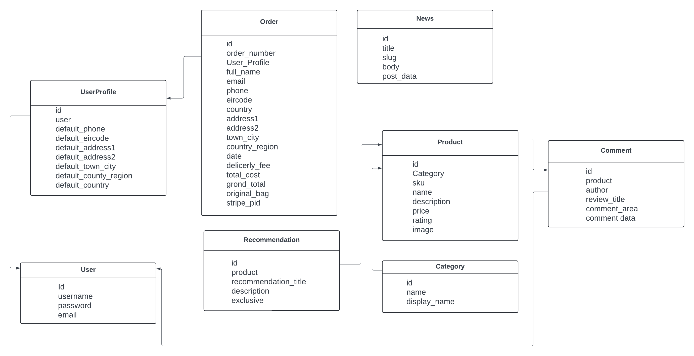
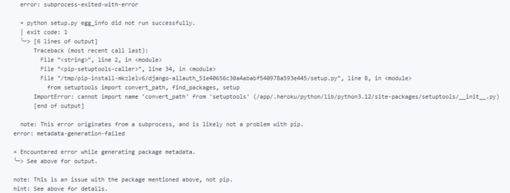

# The Hair Experts

[Go to the website](https://the-hair-experts-530953dace3d.herokuapp.com/)  
[Go to the Github](https://github.com/Chikayo-k/the-hair-experts)

The Hair Experts is the fifth project in the Code Institute Diploma in Full Stack Software Development.
It is a B2C ( Business to Consumer) full stack E-commerce website that offers a range of hair care products and treatments. User’s can create accounts, browse through a selected range of hair care products and items, add them to their basket and purchase them. Users also have the ability to create wishlists and leave comments on products. 

The project was developed using Django, Python, JavaScript, HTML5, CSS and a Postgres relational database to store the site's data. Stripe was used as the payment system

The project was developed using Agile methodologies. This was tracked using Githubs built in boards so I could create Sprints to track the Epics and User Stories.

## Project Goals 

### Project Goal 

The goal of the project is to create a full stack website for The Hair Experts built and developed using the Django framework, Bootstrap and CSS. Using Stripe as a payment system and to be deployed on the internet using Heroku and AWS S3 for storing files.

The project was designed to be easy to use and have a simple flow from product searching to product purchasing. 

### User Goals 

- As a site user I want to shop and browse for hair care products and items.
- As a site user I want to be able to create an account on the website which will track my purchase history and keep track of the wishlist I have created.
- As a site user I want to be able to leave reviews/comments on products I have bought.
- As a site user I want to buy products securely. 

### Site Owner Goals 

- As a site owner I want to have a platform to sell hair care products to people in Ireland, England and Europe.
- As a site owner I want a site that is known for its reliability.
- As a site owner I want a site that can grow.

## Design 

### Wireframe

[Wireframe - Desktop](readme-image/wireframe/wireframe-desktop.jpg)  
[Wireframe - Tablet](readme-image/wireframe/wireframe-tablet.jpg)

### Colour Schemes 

[Color Hunt](https://colorhunt.co/palette/2228312d4059ff5722eeeeee)

When developing the site I wanted to keep the colours simple. Keeping colours simple would make the pictures stand out and not overpower the images for the products with lots of colour.

There was a low accessibility score due to the button contrast ratio.  I changed the buttons background lightness colour to  #AD6200 so that users can see the button more clearly. 

### Fonts 

Logo: font-family: "Playfair Display", serif;

### Favicon 

Used [Canva](https://www.canva.com/) to create

## E-Commerce Business Model 

**Business model: B2C** 

### Target Audience 

From 20 to 60 year old women who live in Ireland that are also interested in hair products. 

### Vision 

To provide customers with top-of-the-range hair solutions and the products that help their hair health reach its full potential.

### Objectives 

The Main objective is to increase profit streams from the online store and expand the market to other demographics and businesses. 

### Strategy 

**To achieve this we need to:**

- Increase the website’s SEO
- Increase Facebook followers
- Increase news letter subscribers

### Digital Marketing 

#### Facebook 

The hair experts will mainly use facebook to advertise our business.
This is the best place to focus on because 75.6% of the population in Ireland are using it. We will plan to upload to our Facebook at least twice a day, one for around lunch time and one for before bed time when our target audience who are busy during the day might have a better chance to see our page. We will research facebook insights to monitor clicks and engagement rates to see how effectively our facebook page and posts are working. We will also take advantage of Facebook advertising to reach as many people as possible. This can be run cheaply by setting a target audience for specific people to advertise. As this e-commerce site grows, running YouTube and google ads would be the next step to increase the company’s online presence which will help to increase our profit.

**Facebook Business Page**

**Example post**

#### Increase the Website’s SEO 

We have a news section that can be updated often. 
We will use keywords that are related to hair products and update on a weekly basis. Topics are something related to hair like how to keep your hair healthy and tips to keep your hair shiny.
This will increase the site’s activity and improve engagement with our customers.

**News Page :**

Upload the contents that are associated mainly with hair and beauty and also sometimes topics that are using current trending keywords to increase the traffic a few times a week. Google Keyword Planner and Google trends are useful tools to find suitable keywords.

### Keyword research 

Searched keywords with [Wordtracker](https://www.wordtracker.com/search?query=professional%20hair%20products%20for%20women) and [Keyserch](https://www.keysearch.co/)

**Meta tag**

Used long tail keyword

 

 **Sitemap and Robots.txt**
 
 Having a sitemap and robots.txt inside the project will incraese the websites SEO (search engine optimization). The sitemap.xml gives search engines access to the site content quickly. When new features or pages have been added updating the site map lets the search engine know.
 
 The robots.txt file is to restrict the search engines access to sensitive pages or locations on the site. When using robot.txt files it is important to remember that not everything should be exposed like the pages that contain personal information like user names and payment details. 

 [sitemap](sitemap.xml)  
 [robots.txt](robots.txt)

### Email Marketing 

Website has a newsletter section where customers can subscribe and get our news and special offers. We use mailchimp to send our campaigns so that we can track 
Open rates, click through rates and bounce rates.
This is good because we can test our emails to see what works or does not work.
Sending email to our customers also increases our website’s traffic and leads to calls to action.
We will use facebook posts to increase subscribers.

## Project Structure 

The project will consists of 17 amount of pages:

- The home page 
- The product page 
- The add item page
- The details page 
- The edit item page
- The checkout page 
- The checkout success page
- The shopping bag page
- The newsletter page 
- The newsletter success page 
- The newsletter fail page 
- The login page 
- The logout page
- The profile page
- The news page
- The news add page
- The news edit page

### Flow Diagram 

### Database Design

### Technologies Used 

Main technologies used:
- HTML - Used to create the basic design of the website
- CSS - Used to create the style of the webpages
- JavaScript - Used to add client side features
- Python - Used to build this project of backend
- Django - Main framework of this project
- Postgres - Used as the projects database
- Heroku - Used to deploy the project
- Gitpod - Used to develop the project
- GitHub - Used to track the project progress
- Bootstrap - Frontend framework
- Stripe - Secure payment system
- Amazon S3 - for storing media and static files for the website
- Mail chimp for storing using emails as part of the subscription service.

## Agile Methodology 

**Overview**

The Hair Experts application was developed using the Agile methodology.
Using GitHub projects, I created Epics, User Stories and Milestones to track all my work.

- I used Sprints and broke the work into Epics (large stories) and these were broken down into smaller User Stories which were broken down into task and acceptance criteria. 
- The User Story would be finished when all the tasks had been completed.
To track where work belongs I used labels.
- Labels let me link my User Story and Epics and this can be seen visually on the board.
- Each Sprint had its own board for tracking work. With three columns.
- Once all tasks that are linked with the Sprint have been completed the Sprint can be closed off.

To do – these are tasks taken from the backlog into the sprint that has not yet been started.

In Progress – These are the current tasks I am working on.

Done – These are the tasks I have completed.

**Sprints**

I had 4 sprints which included all the work listed in the Epics and user Story section. I Have included links to the sprint boards in GitHub projects and a screenshot of the finished Sprint board.

Click here to check details [User Story Test - TEST.md](TEST.md#user-stories-test)

More details, you can check form [here (The Hair Expert Github Page)](https://github.com/Chikayo-k/the-hair-experts/projects?query=is%3Aopen) 

## User Experience (UX) 

### Navigation Bar
Navigation bar contains the links to the different website sections. The main page is the product page which also has a dropdown feature where you can select categories. You also have the search bar where you can search specific products by typing keywords in the box. The logo can be used to navigate to the home page. A user can easily access the other pages on the site to view Hair Products, Electrical Items and News. The layout will allow users to see everything the website has to offer at a glance.

The navigation bar features a news tab so that users can stay up to date with the website's latest news as well as a search bar that lets user’s search for an item directly.

**dropdown**

The Navigation bar allows users to refine their search. They can browse all the site products. They can choose to select just hair products that will show the user what they offer. 

**Filter** 

When the user selects the electric section and selects only the hair dryer then this will be all that is displayed. This offers the user the ability to refine their search to find whatever it is they are looking for.

### Home Page 

The website's home page showcases the main image or Hero image it is intended to grab the users attention.The shop now button goes directly to the product page that renders all the products this shop sells.

**Deliverly charge**

When a user reaches 50 euro free delivery will be applied to their shipping. The amount displayed will change depending on what is inside the basket. Once the limit has been reached it will be set to free shipping. This benefits the user so they can decide if they want to spend more.

On the home page, the products have been categorised into three sections. This will make it easy to find products.

Memo:
Clicking on the shampoo and conditioner section will display the set products because the set includes both shampoo and conditioner

### Footer

The foot sections mark the bottom of the page. It contains links to the hair experts social media sites which users can use to visit our social sites to learn more about us and keep updated on our latest news.

#### Help Center 

The help centre section gives the user the option to reach out to a member of the team for help if they need it. This lets the user know we will listen to their problems if they have one and try and help them solve it

### Product Page 

Product page shows product pictures,product name and price. Clicking on the picture can take the user directly to the product’s detail page. When the admin user is logged in it will display an edit and delete button that shows that the admin can control their stock from the product page. This is beneficial for users as the site 

#### Sorting Feature 

Sorting functionality on the products. Users can sort based on the sorting options below to help them find what they are looking for quicker.

### Detail Page 

Displays details of product. Users can view the product's details and see if it is the right fit for their needs.

On the detail page when the admin user is logged in they can see the edit and delete button next to rating. This allows the admin control over the shop's stocks and users will always be kept informed on what products we have available.

#### Review 

All users can view comments that have been left on product’s.
But the delete button is only visible to the user that wrote the comment.
Also when the user is logged in they can see the add comment for a product button. Once you click it, a comment form will be displayed that the user can leave a comment on this product. This is only visible for users that have logged in.

### Shopping Bag 

As the user shops on the site they can add products to their basket. When a product is added to the basket it will display the quantity of the product they have added as well as the price. This will let users know how much they are spending and how many items they are buying. 
User can also remove items from their basket this will decrease the price and the quantity.
This makes it easy for users to make changes inside the shopping bag. 

#### Recommendations 

In the shoppoing bag they will see a recommendation for products at the bottom of the page. This will display recomendded products that might interest the user.

When the Read Me button on the recommendation section is clicked a modal opens and displays details of the recommendation product. Clicking the picture of the product brings the user to the product detail page.

### Checkout page 

Once the user has added the products to the basket. The user will see a form where they fill out their personal details including their address. This section also includes the secure payment form where users can input their card details to pay for their purchase.

This will benefit users as they can enter their personal details so they can ensure their products will be sent to the correct address and person. The secure payment allows users to safely enter card details and make payments. 

#### After complete order button is pressed 

When the user confirms their order they will see a spinning wheel this lets the user know their order is being processed. 

#### Confirmation message after the shopping 

When the purchase has been successful the user will see the confirmation pop up. This contains all the information the users need to know about their order.  This information benefits the user if they have any issue or need to find out anything about the order. 

### Sign Up 

Users can sign up and create an account for the website. Once a user has created their account they can access other features like adding and deleting comments. 

When creating their account the user will be asked to confirm their email address, this lets the user know they have entered the correct email address.  

After confirm your email, you can login.

## Log In 

Once a user has successfully created an account they can then login to their account through the login section of the website. 

After login, you can go to my profile from my account dropdown and see your delivery info and order history

### Add / Edit / Delete item (admin) 

The website uses role based access for its users. When you login as an admin, product management will show up which controls the shop's stock items. 

Admins can add a product from the product management page. when you log in as admin edit and delete button will be displayed on the product page or the product’s detail page.

The admin user can simply delete an item from the website with a simple click. This means that the site can be kept up to date so customers will always know what items are available.  

Once click the edit button edit page will show up.

### News Letter 

Users can subscribe to our newsletter. In order to subscribe users will input the email address and will be added to our mailing list. Once subscribed the user will receive our newsletter with the latest news and special offers. 

**After subscription**

If the user subscribes to the email successfully it will display a success page.  Otherwise it will display a subscription failed page and the user will be asked to try again. This lets users know if they have been added to the mail list.  

This shows an email being successfully registered on mailchimp.
It was tested with [temp email](https://temp-mail.org/en/) which allows you to create a temporary test email.

### News Page 

News section. Users can view new news that has been added to the site. The Admin can update news from the add news button.
Admin can add edit and delete the news when they are logged in. This benefits users as they can see the site's latest news. 

### 404 Page 

When a user tries to select a page that doesn't exist they will see the custom 404 page. This is a benefit to users as it lets them know clearly the page they are trying to access doesn’t exist.

## Future Features 

- A future feature will be to allow users to request specific items. 
- Add more payment methods so as not to exclude customers.

## Testing 

All the test details are in the [TEST.md](TEST.md)

## Bugs / Errors / Issues/

**Data issue**

As I had input all product data myself through the admin panel, I had to go through different steps when I was transferring it. I used the dumpdata and load data commands to transfer the contents from sqlite to postgres.

dump command:  
python3 manage.py dampdata products.Category > categories.json  

And loading:  
python3 manage.py loaddata categories.json

**Version issue**

Due to an issue with the latest version of python that was installed on heroku and the version of allauth that was installed (setuptools is removed from the latest python version) I needed to install a specific version of allauth to resove a deployment issue. I used the below command to use a specific version of django-allauth.

pip3 install django-allauth==0.50.0  
pip3 freeze > requirements.txt

## Deployment 

### Clone 
- Clicking on the code dropdown in the main repository.
- Copying the SSH URL
- I opened my git bash terminal and cloned the project to a folder on my desktop.

### Fork

A Git fork is when an existing repository has a copy taken of it and it becomes its new repository no longer being attached to or tracking the commits of the original repository. I used the original project I had cloned at the start. I could not fork the project the repository as I am the owner but the steps to fork are

- Open the repository on GitHub and select the Fork dropdown
- Click fork you will have a full copy of the repository.

### Heroku 

- Create requirements for deployment on the project file.
- Create a Heroku account and set it up if needed.
- Click the Create New App button.
- Name the App and select a region then click Create App.
- Click the settings tab and create the Config Vars.
- Config vars should include:

  AWS_ACCESS_KEY_ID  
  AWS_SECRET_ACCESS_KEY  
  DATABASE_URL  
  EMAIL_HOST  
  EMAIL_HOST_PASS   
  EMAIL_HOST_USER  
  SECRET_KEYS  
  STRIPE_PUBLIC_KEY  
  STRIPE_SECRET_KEY  
  STRIPE_WEBHOOK_SECRET  
  USE_AWS  
  MAILCHIMP_API_KEY  
  MAILCHIMP_MARKETING_AUDIENCE_ID  
  MAILCHIMP_REGION  

- Install a production-ready web server for Heroku.
- Add requirements.txt file.
- Create a Procfile file in the project and execute to the Django project.
- Set setting.py where it is necessary.
- Add buildpack select node.js and save changes.
- Go back to the deploy section.
- Choose the deployment method for GitHub.
- Click the Connect to GitHub button.
- Search for a repository name and connect to link up the Heroku App to the GitHub - repository code.
- Use the Manual deploy option and click the Deploy Branch button.
- When the App is successfully deployed, the View button will show up. The button is the deployed link.

### Amazon S3 

S3 is a cloud based storage service which we is used for storing the projects the images and static files (CSS)

Steps to set up AWS S3:

- Create an AWS amazon account (personal) and locate the S3 through the search bar.
- Create a new bucket using the same name as the Heroku app that was created.
- Set the bucket to be public and allow public access. Acknowledge that the buckets and its contents will be public.
- Once created select the bucket and navigate to properties and select the static hosting sections. Use this bucket to host a website. For the index and error html use the default values.
- Go to the permission tab and add a new CORS configuration that will let the Heroku and bucket communicate.
- Generate a S3 Bucket policy this is to create a security policy for the bucket.
- In the access control list set the public access to everyone.
- Setup IAM (Identity and management) section.
- Create a group for your bucket and a policy using the S3 full access policy.
- Attach the policy
- Create the user for the group and policy use the project's name as the user.
Add the user to the group where you have the policy attached
- Download the .csv file containing the users access key and the secret access key these are used to authenticate in the Django app.
- Install boto3 and Django-storages and freeze them into the requirements.txt file.
- Set up the connections between Heroku and S3 in the settings.py file.
- Add the AWS keys to the Heroku config vars.
- Set the static files and images location for S3.
- A static folder will now be created in S3 with the project's static files. 

### MailChimp 

As part of developing the hair experts I included the Mailchimp service to set up a newsletter subscription service. This allows users to subscribe to our newsletter.

Steps:
- Create a new app in the Django project. I called my app Newsletter.
- Add the new app at the project level.
- Add the new URLs for the app in the urls.py file.
- Create the new html and css files for the subscription form. 
- Add the Mailchimp packages for Django to let the project connect to the API’s.
- Create a Mailchimp account.
- Open the account API tab and select Extras.
- Select API keys
- Create a new API key and save it to add to the project.
- Use the region you are in it can be seen on the url in the format us1.
- Add these to your settings.py
- Include this import in the view: from mailchimp_marketing import Client
- Check the deployment url and append /marketing/ping/
- The response is “Everything’s Chimpy”
- Create your audience and copy the Audience ID and add it under settings.py with the other Mailchimp API’s.
- Once completed when a user subscribes on the form it will be registered in the Mailchimp app.

## Stripe

Payment system is used Stripe.  
When using the Stripe payment system users need to use the Stripe test Visa Card.

To complete test payment:

Test card number: “ 4242 4242 4242 4242”.  
The MM/YY number needs to use a future date. Eg - “04/25”   
CVC and ZIP can be a selection of any number.

## Reference

I used Code Institute study materials and the walkthrough project in coming up with the idea for my project. I used w3schools and Django documentation to check how to write code as well as the different types of methods that were available for this project.  
When I ran into an issue, I used Code Institute's tutor assistance and received great help.

[Integrating Mailchimp with Django](https://testdriven.io/blog/django-mailchimp/)  
[W3schools - html / css / javaScript/ python reference](https://www.w3schools.com/)  
[Some issues solved with stackoverflow](https://stackoverflow.com/)  
[Wish list reference](https://www.youtube.com/watch?v=A8rarkE0TKQ)

**Images / others**  

I used ChatGPT to create product images.  
[Pexels](https://www.pexels.com/)  
[Pixabay](https://pixabay.com/)  
[unsplush](https://unsplash.com/)  
[Fontawsome](https://fontawesome.com/)  
[Canva](https://www.canva.com/)
[Google fonts](https://fonts.google.com/)

**Test**

[W3C Markup Validation Service](https://validator.w3.org/)  
[W3C CSS Validation Service](https://jigsaw.w3.org/css-validator/)  
[Jshint.com](https://jshint.com/)  

