# Testing

This is the Testing section of the [README.md](README.md) file.  
It  contains all the testing information for the project The hair expert.

## Validation

### HTML Validation

HTML validation all passed.

**Home page**

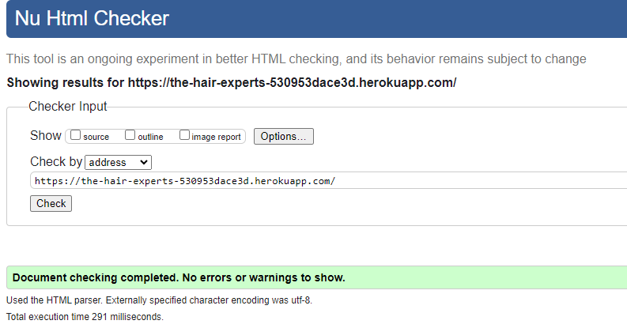

**Product page**

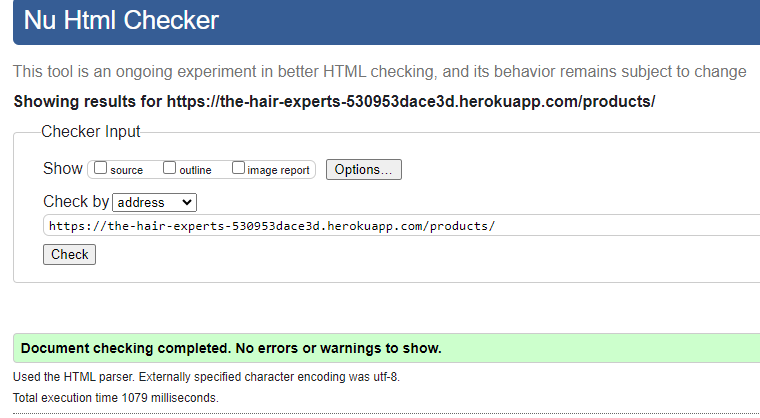

**Product detail page**

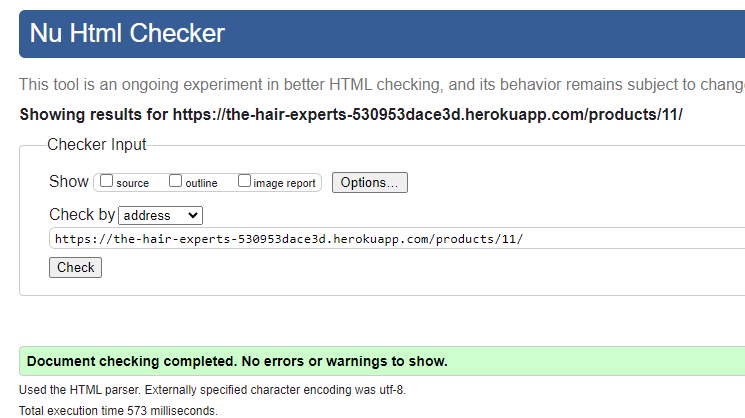

**Shopping bag page**

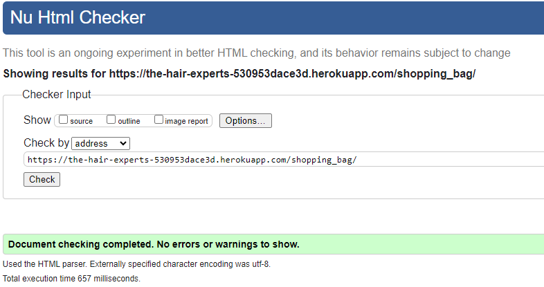

**Check out page**

There is no error present.

However, one warning for h1 tag using for spinner.
As this is a warning, I decided to leave as is.
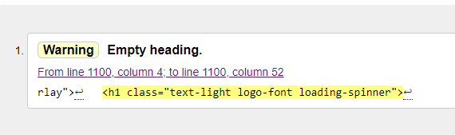

**Check out Success Page**

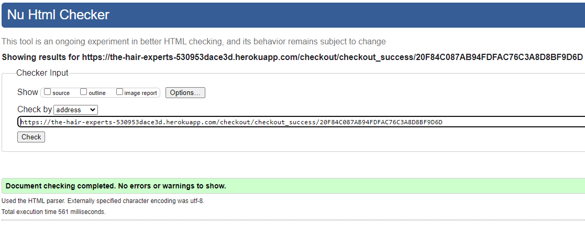

**News page**

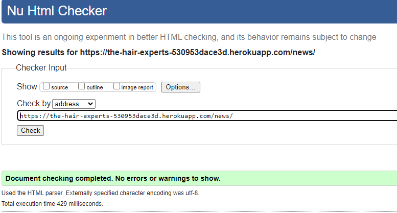

**Sign Up page**

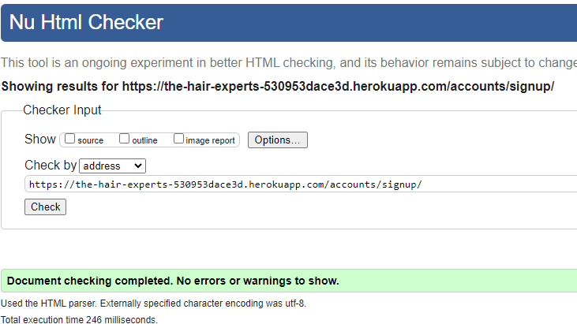

**Login page**

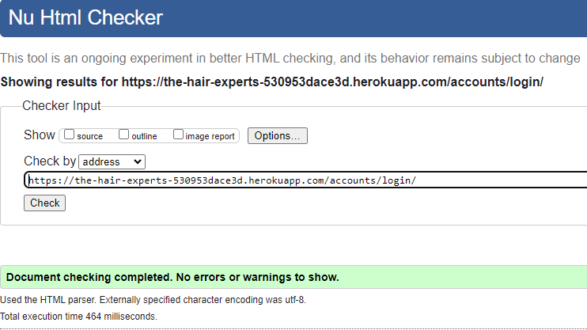

**Logout page**

**My Profile Page**

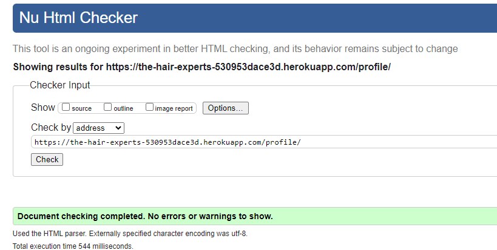

**Stock Management Page**

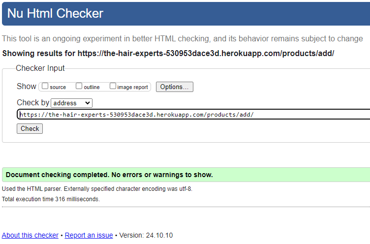

**Edit Product Page**

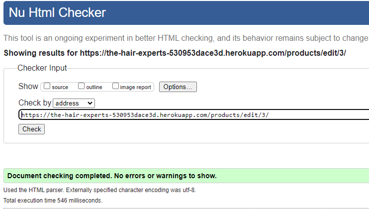

## Lighthouse testing

All the lighthouse testing scores are high. Only the Best Practices score is below 80 this is because of cookie related issue with version 3 of stripe.

**Home Page**

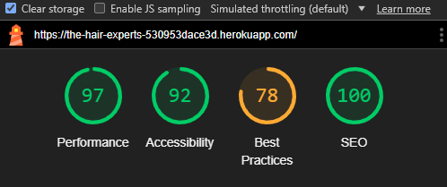

**Product Page**

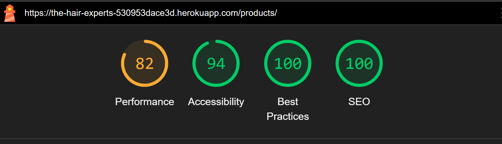

**Detail Page**

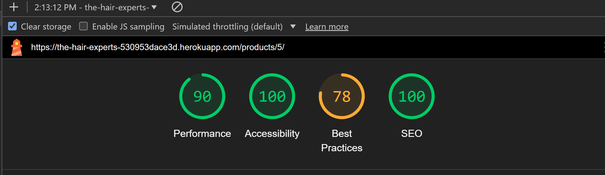

**Shopping bag page**

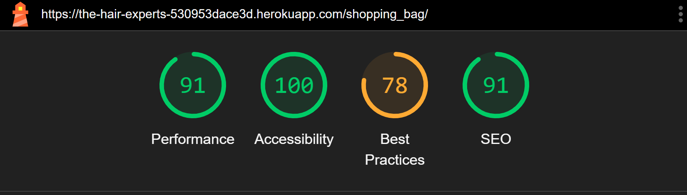

**Check out page**

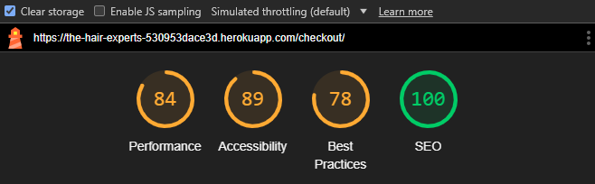

**Check out Success Page**

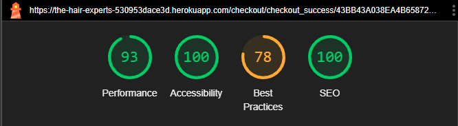

**News page**

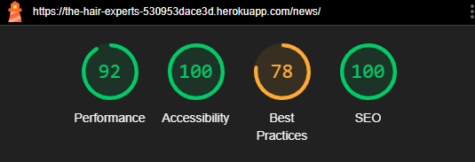

**Sign Up page**

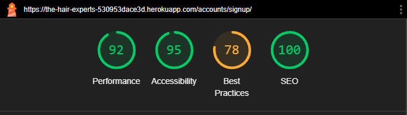

**Login page**

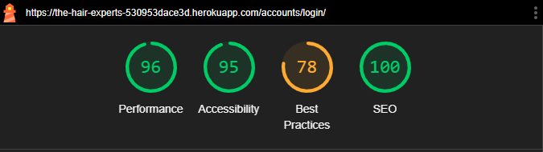

**My Profile Page**

**Logout Page**

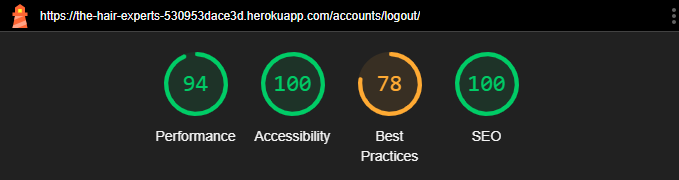

**Stock Management Page**

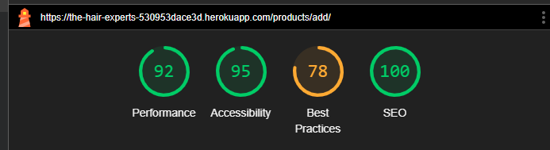

**Edit Product Page**

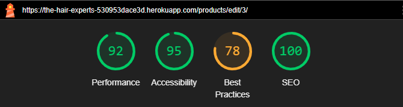

# CSS Validator Test

All the css file are passed

**base.css**

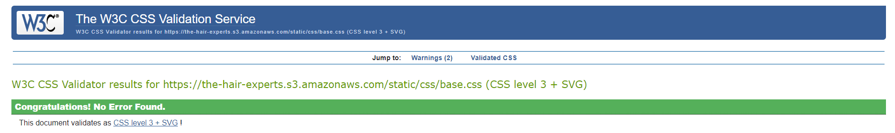

**product.css**

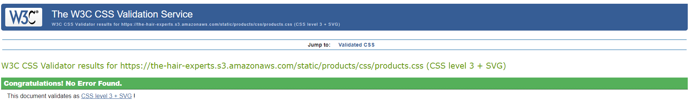

**shopping_bag.css**

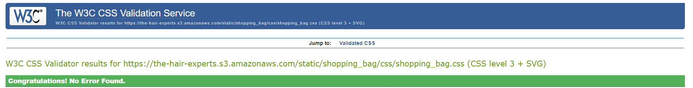

**news.css**

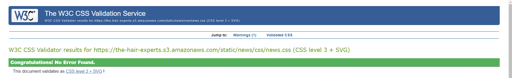

**profile.css**

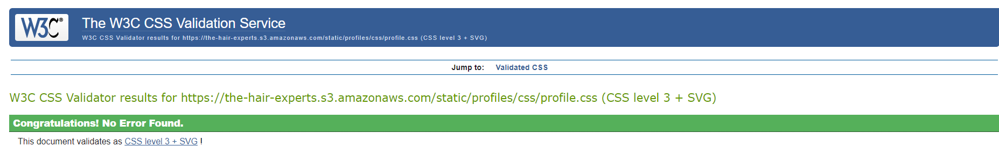

**checkout.css**

