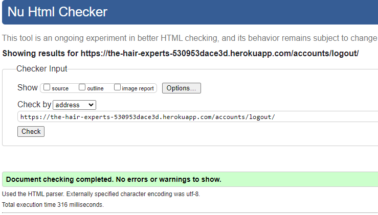
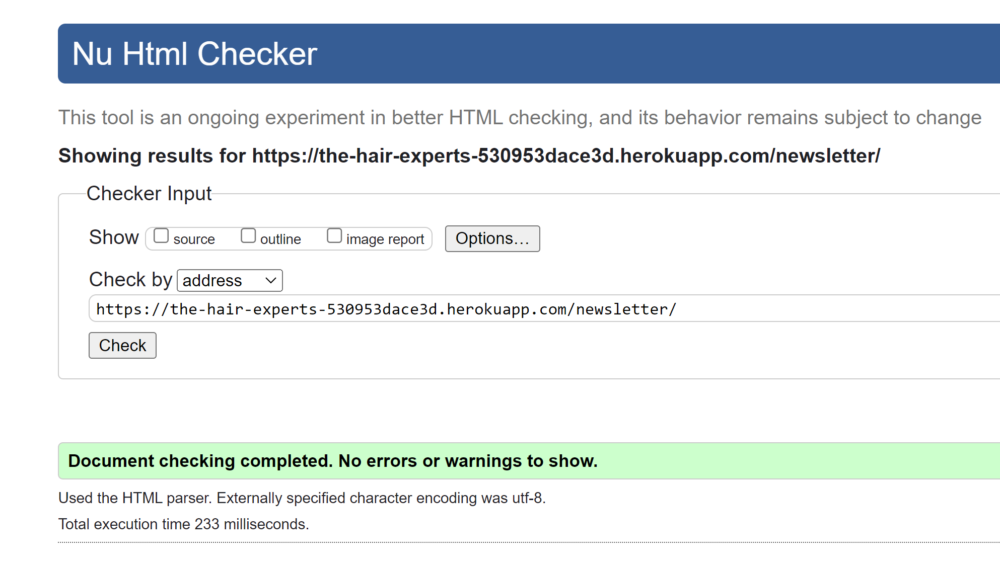
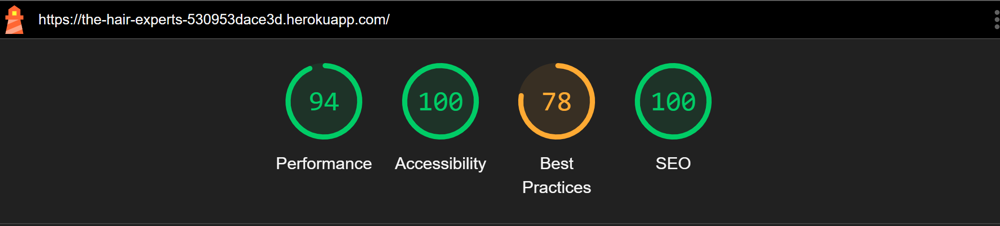
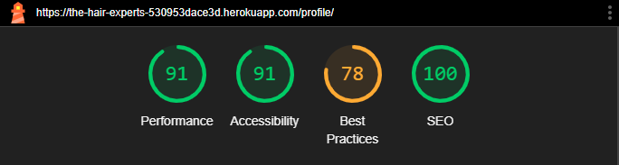

# Testing

This is the Testing section of the [README.md](README.md) file.  
It contains all the testing information for the project The hair experts.

## Responsiveness

Tested on mobile, tablet, laptop and desktop. 
And all devices works as expected.

## Validation

### HTML Validation

HTML validation all passed.

**Home page**

**Product page**

**Product detail page**

**Shopping bag page**

**Check out page**

There is no error present.

However, one warning for h1 tag using for spinner.
As this is a warning, I decided to leave as is.

**Check out Success Page**

**News page**

**Sign Up page**

**Login page**

**Logout page**

**My Profile Page**

**Stock Management Page**

**Edit Product Page**

**News Letter**

**News Letter Success Message Page**

**News Letter Fail Message Page**

## Lighthouse testing

All the lighthouse testing scores are high. Only the Best Practices score is below 80 this is because of cookie related issue with version 3 of stripe.

**Home Page**

**Product Page**

**Detail Page**

**Shopping bag Page**

**Checkout Page**

**Checkout Success Page**

**News Page**

**Sign Up Page**

**Login Page**

**My Profile Page**

**Logout Page**

**Stock Management Page**

**Edit Product Page**

**News Letter Page**

**News Letter Success Message**

**News Letter Fail Message**

# CSS Validator Test

All the css files have passed.

**base.css**

**product.css**

**shopping_bag.css**

**news.css**

**profile.css**

**checkout.css**

**newsletter.css**

## JS Hint

**base.js**

**countryfield.js**

**strip.js**

There are strip undifined variables. as they are coming from different app I left these as is.

## Testing User Stories ##

### Sprint1 ###
**Epic 1 Create the initial project setup**

- [x]  As a Developer, I want to create the project structure so I can develop the Hair Experts website

**Epic: 2 Create home page**

- [x] As a user, I want to be able to open the home page and understand what is this website for.

- [x] As a user, I want to have easy navigation so that I can move through the pages on the site.

- [x] As a user, I want to browse the footer of the webpage so that I can see what's there.

- [x] As a user, I want to see if the website has social media so that I can visit them.

- [x] As a user, I want to be able to access the website on any device so that I can view the content.

**Epic 3: Product setup**

- [x] As a developer I want to create the websites database and add products

- [x] As a user, I want to see the products page clearly so that it is easy to find products.

- [x] As a user I want to click on the product image and have a details page open.

### Sprint2 ###

**Epic 4: Create Product Filtering and Sorting**

- [x] As a user, I want to be able to sort products on the products page so that I see sort by different categories.

**Epic 5: Create shopping basket functionality**

- [x] As a user I want to be able to add items to my shopping basket so that I can see what is in the basket.

- [x] As a user I want to be able to modify the items of my shopping basket so that I can change my order.

**Epic 6: Create Notifications**

- [x] As a user, I want to see a notification when I add, update and delete item to the shopping basket so I see what is in the basket

- [x]
- [x]
- [x]
- [x]
- [x]
- [x]
- [x]
- [x]
- [x]
- [x]
- [x]
- [x]
- [x]

- [x]
- [x]
- [x]
- [x]
- [x]
- [x]
- [x]
- [x]
- [x]

